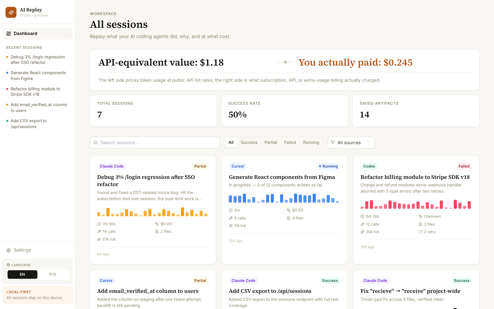
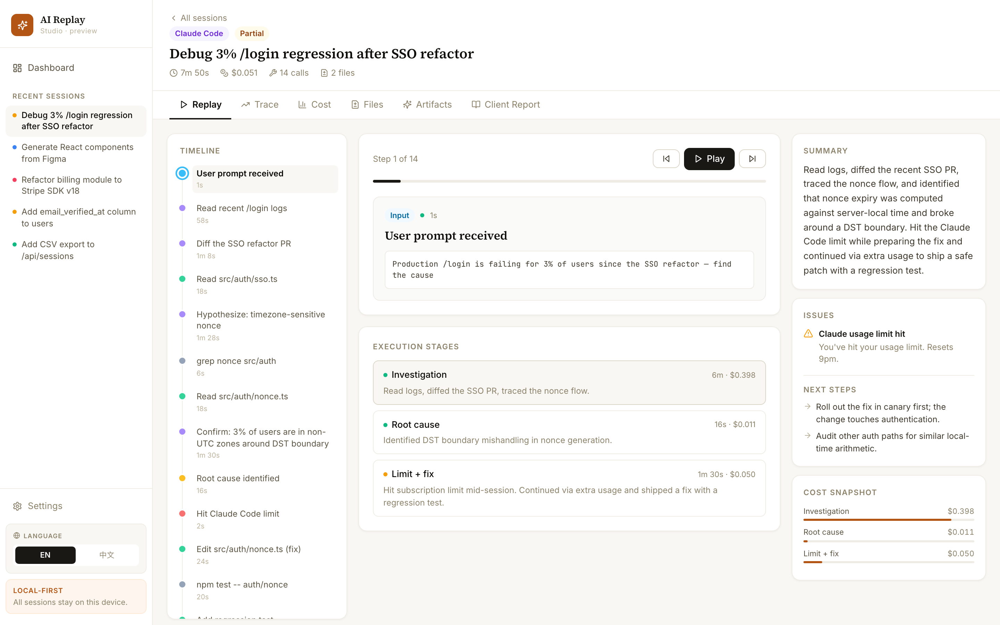
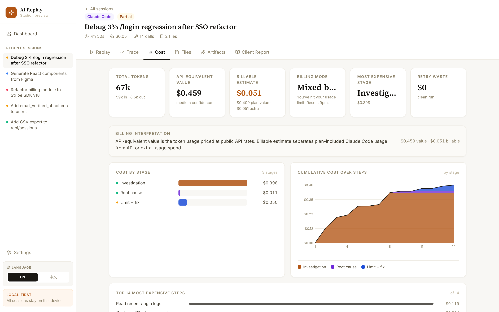
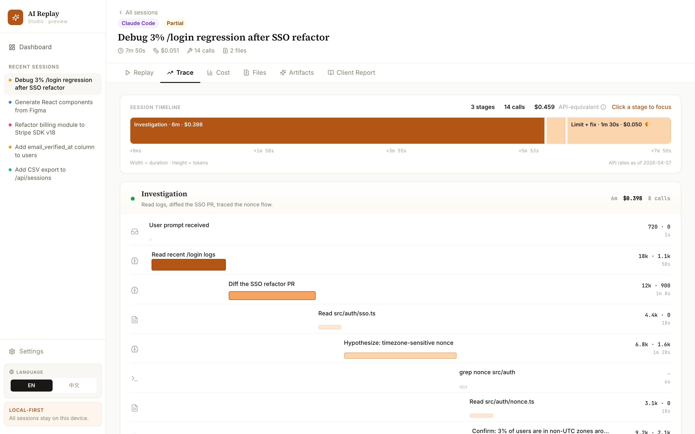
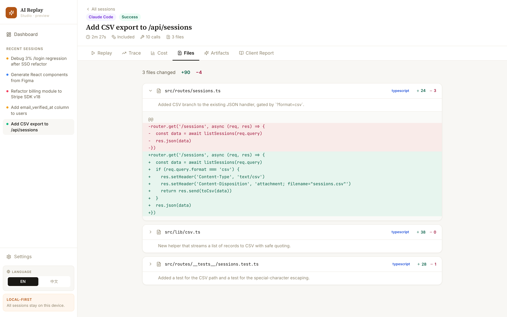
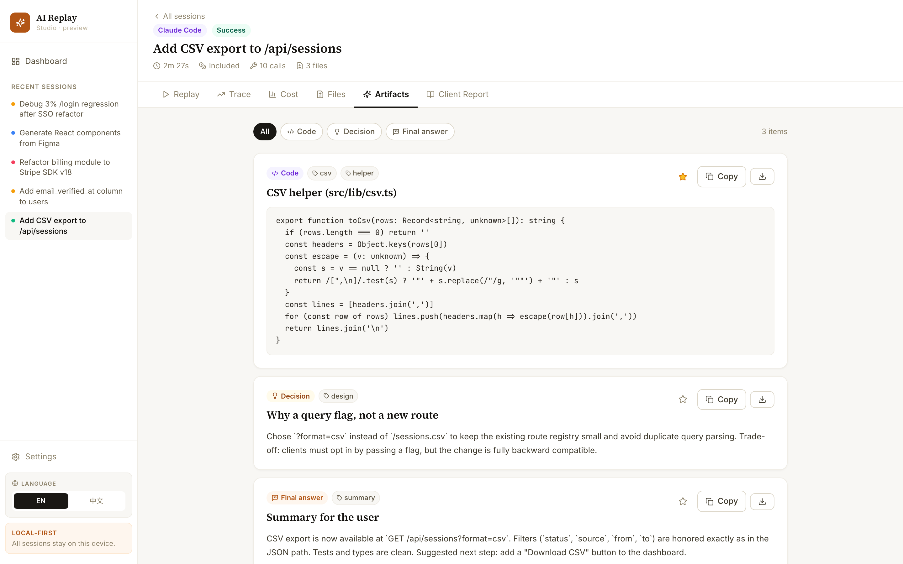
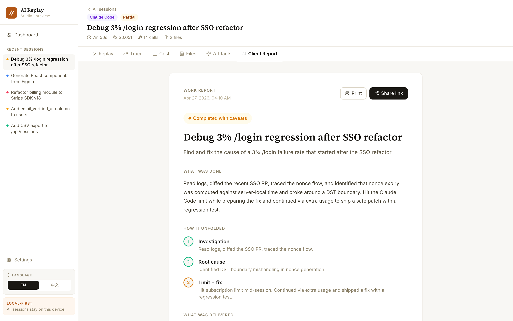

# AI Replay Studio

> **See what your AI coding agents actually did — and what they really cost.**
> Reads your local Claude Code and Codex transcripts, turns them into a
> session dashboard with timeline replay, tool graph, file diffs, artifacts,
> and an honest cost-vs-billable breakdown.

<p align="center">
  
</p>

<p align="center">
  <a href="https://github.com/zhuyihenzheng/ai-replay-studio/actions"></a>
  <a href="LICENSE"></a>
  
</p>

---

## Why this exists

Modern coding agents do a lot of work autonomously — and you usually have
no good way to look back at it.

- **You don't know what they actually did.** Tool calls scroll past in a
  terminal. By the next morning the context is gone.
- **You don't know what they really cost.** Claude Code Pro/Max bills very
  differently from raw API usage. Most "cost" displays only show the API
  list-price equivalent and quietly imply you paid that amount.
- **You can't easily share the work product.** When a stakeholder asks
  *"what did the agent ship?"*, scrolling a JSONL file isn't an answer.

AI Replay Studio reads the local transcripts your agent already writes and
gives you a dashboard you can scrub through, share, and reason about.

It's deliberately **not** a billing source of truth — local logs don't
contain enough to make that claim — and the UI never pretends otherwise.

---

## Quick start

```bash
npm install
npm run dev -- --host 127.0.0.1
# open http://127.0.0.1:5180/
```

A fresh clone ships with a built-in **demo dataset** (seven fictional
sessions across Claude Code, Codex, and a planned Cursor importer) so the
dashboard is populated immediately.

To replace the demo data with your own real sessions:

```bash
npm run sync
```

That writes a **gitignored** `src/data/claudeSessions.local.json` derived
from `~/.claude/projects/**/*.jsonl` and `~/.codex/sessions/**/*.jsonl`.
Tracked source files never contain your transcripts.

---

## What you see

| View | What it answers |
|---|---|
| **Dashboard** | Across all sessions: how many succeeded, API-equivalent value vs. out-of-plan spend, saved artifacts. Filter by source, status, and **time range (defaults to the last 7 days)**; search by title. |
| **Session replay** | Step-by-step: prompt → tool calls → outputs → retries → final answer. Stage boundaries are derived from user-turns, not model self-narration. |
| **Trace** | A step-proportional timeline: each stage is a segment whose **width = its share of steps** and whose **color = status**, over a collapsible step list. Routine same-kind runs auto-group; failed/retried steps are flagged. Deliberately free of dollar/token clutter — that lives in **Cost**. |
| **Cost analysis** | API-equivalent value, billable estimate, retry waste, cost-per-stage, top expensive steps. Cards label confidence (`high` / `medium` / `low`) so you know when an estimate is shaky. |
| **File changes** | Every file the agent touched, with a captured diff. |
| **Artifacts** | Final answers, decisions, code snippets, commands worth keeping. Supports favorites. |
| **Client report** | A view that hides raw tool calls and shows the deliverable — for stakeholders, not engineers. |

Every session tab shares one frame (fixed header + tabs, one canvas, one
content width), so switching tabs doesn't shift the layout. The interface
is available in **English, 简体中文, and 日本語** — auto-detected from the
browser and switchable in the sidebar. Your transcript content is never
translated, only the UI chrome.

<details>
<summary><b>📸 Screenshot gallery</b> (click to expand)</summary>

<br />

**Session replay** — the timeline + the step you're inspecting + execution stages.


**Cost analysis** — API-equivalent vs. billable, including a session that hit the Claude Code subscription limit and continued via extra usage.


**Trace** — a step-proportional bar (stage width = share of steps, color = status) over a collapsible, auto-grouping step list.


**File changes** — every file the agent touched.


**Artifacts** — keepable outputs (code, decisions, final answers, commands).


**Client report** — a stakeholder-friendly view that hides the raw tool stream.


> All screenshots are captured from the bundled demo dataset.
> `npm run screenshots` regenerates them; the script forces `VITE_FORCE_DEMO=1`
> so it can never include your real synced transcripts. They may lag the
> latest UI tweaks until regenerated.

</details>

---

## The cost-vs-billable model

This is the part that makes the project useful.

For every session and tool call, the importer records two distinct numbers:

- **API-equivalent value** — what the token usage would cost at public
  Anthropic API list prices. Helpful for comparing models, comparing tasks,
  and reasoning about plan headroom.
- **Billable estimate** — what should actually appear on a bill. For Claude
  Code Pro/Max usage, this is usually `Included`. After a `You've hit your
  limit` event with extra-usage enabled, post-limit work is classified as
  `Extra usage`. For Codex local logs, billing is `Unknown` — token usage
  is real but local logs don't prove the dollar attribution.

Each session carries an `evidence[]` array explaining how it was classified
and a `confidence` level. **No magic numbers.**

Configure how your usage should be interpreted via env vars before
`npm run sync`:

| Variable | Values | Purpose |
|---|---|---|
| `CLAUDE_REPLAY_BILLING_MODE` | `subscription`, `api`, `extra-usage`, `unknown` | How to interpret billable spend |
| `CLAUDE_REPLAY_EXTRA_USAGE` | `true`, `false`, `unknown` | Whether usage after a Claude limit event is billable |
| `CLAUDE_REPLAY_PLAN` | free text | Display label like `Pro`, `Max`, `Team` |

For exact team/org accounting, reconcile with the Anthropic Usage and Cost
API or the Claude Code Analytics API. Details: [docs/billing-model.md](docs/billing-model.md).

---

## Supported sources

| Source | Status | Notes |
|---|---|---|
| **Claude Code** | ✅ Supported | Reads `~/.claude/projects/*/*.jsonl` |
| **Codex** | ✅ Supported | Reads `~/.codex/sessions/**/*.jsonl`. Token usage is captured; dollar billing is left as `Unknown`. |
| **Cursor** | 🛠 Planned | Needs a dedicated importer for Cursor's log/export format |

---

## Tech stack

Vite · React 18 · TypeScript · Zustand · Tailwind CSS · React Router · Lucide.

Charts and the trace timeline are hand-rolled SVG/CSS — no charting
library. (`reactflow` and `recharts` are still in `package.json` from an
earlier design but are no longer used; see Roadmap.)

The importer is plain Node ESM — no build step, no native dependencies.

---

## Architecture

```text
scripts/sync-claude-sessions.mjs
  Reads Claude Code and Codex JSONL transcripts, normalizes them to the
  Session shape, classifies billing, and writes
  src/data/claudeSessions.local.json (gitignored).

src/types/index.ts
  Shared types: Session, Stage, ToolCall, TokenUsage, CostEstimate,
  BillingBreakdown, Artifact.

src/store/index.ts
  Loads local synced data when present; falls back to a tracked empty
  stub; falls back again to the bundled demo dataset.

src/pages/*
  Dashboard, replay, graph (Trace), cost, files, artifacts, client report.

src/components/SessionShell.tsx
  Shared per-tab frame (fixed header + tabs, one canvas, one content
  width) so every session tab is laid out consistently.

src/i18n/*
  English / 简体中文 / 日本語 dictionaries + a tiny typed t() helper
  with browser-locale detection.

src/lib/cost.ts
  UI helpers for API-equivalent vs. billable display.
```

---

## Roadmap

- [ ] Cursor importer
- [ ] Sanitized export: redact prompts/paths/diffs in-place so a session
      can be shared safely
- [ ] Account-level reconciliation with the Anthropic Usage and Cost API
- [ ] Streaming view for long-running sessions
- [ ] Prune now-unused deps (`reactflow`, `recharts`) from `package.json`
      — they're already tree-shaken out of the build (production JS is a
      single ~300 KB chunk), so this is housekeeping, not a size fix

---

## Contributing

Issues and PRs are welcome — especially:

- New importers (Cursor, Aider, custom agent transcripts).
- Pricing-table updates as Anthropic / OpenAI publish new model rates.
- Better visualizations for the tool graph and cost analysis.

See [CONTRIBUTING.md](CONTRIBUTING.md). Security issues: please follow
[SECURITY.md](SECURITY.md).

---

## Privacy

Local transcripts can contain prompts, file paths, commands, diffs, and
tool outputs. The sync script writes these to `claudeSessions.local.json`,
which is gitignored. The tracked stub at `src/data/claudeSessions.json`
stays as `[]`. **Never commit your synced data.** If you fork this project
and want to share screenshots or videos, use the bundled demo dataset.

---

## License

[MIT](LICENSE) © 2026 AI Replay Studio contributors.
