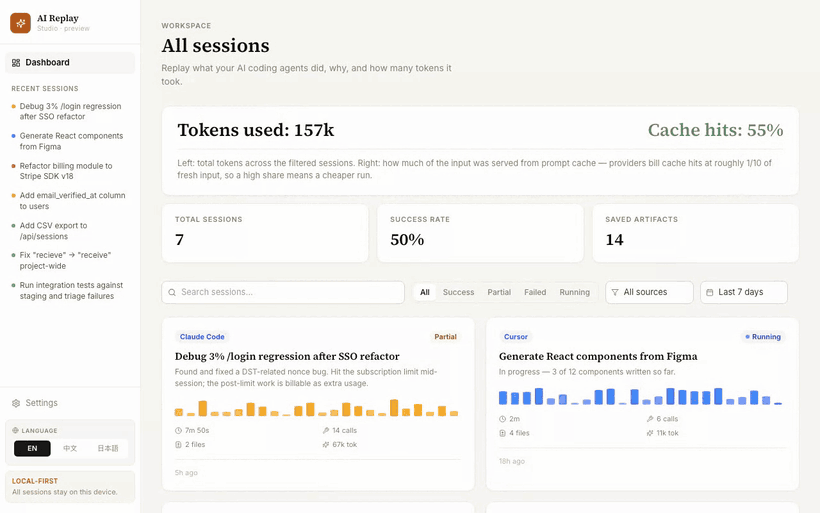

# AI Replay Studio

> **See what your AI coding agents actually did — and what they really cost.**
> Point it at your local Claude Code / Codex transcripts and get a
> scrubbable session dashboard: timeline replay, a step trace, file diffs,
> kept artifacts, and an honest cost‑vs‑billable breakdown. 100% local.

<p align="center">
  <a href="https://github.com/zhuyihenzheng/ai-replay-studio/actions"></a>
  <a href="LICENSE"></a>
  
  
  
</p>

<p align="center">
  
</p>

Run it locally in ~30 seconds — [**Quick start**](#quick-start). It ships
with a fictional demo dataset so the dashboard is populated on first run.

---

## Why you'd want this

Coding agents do a lot of work autonomously, and the moment it scrolls off
your terminal it's effectively gone:

- **What did it actually do?** 60 tool calls flew by; tomorrow you have a
  vague memory and a dirty working tree.
- **What did it really cost?** Claude Code Pro/Max bills nothing like raw
  API usage. Most "cost" readouts only show the API list‑price equivalent
  and quietly let you assume that's what you paid.
- **What do I tell the stakeholder?** "Scroll this 200 MB JSONL" is not a
  status update.

AI Replay Studio turns the transcripts your agent **already writes** into
something you can replay, reason about, and hand off — without sending a
single byte off your machine.

It is deliberately **not** a billing source of truth. Local logs don't
contain enough to make that claim, and the UI says so instead of pretending
otherwise. Honest beats impressive.

---

## What's inside

| View | What it answers |
|---|---|
| **Dashboard** | Across sessions: success rate, API‑equivalent value vs. out‑of‑plan spend, saved artifacts. Filter by source, status, and time range (defaults to the last 7 days); search by title. |
| **Session replay** | Step-by-step: prompt → tool calls → outputs → retries → final answer. Stage boundaries come from your user‑turns, not the model's self‑narration. |
| **Trace** | A step‑proportional timeline — each stage's **width = its share of steps**, **color = status** — over a collapsible step list. Routine same‑kind runs auto‑group; failures/retries are flagged. No dollar/token clutter; that lives in **Cost**. |
| **Cost analysis** | API‑equivalent value, billable estimate, retry waste, cost‑per‑stage, top expensive steps — each card labels its `confidence` so you know when a number is soft. |
| **File changes** | Every file the agent touched, with a captured diff. |
| **Artifacts** | Final answers, decisions, code snippets, commands worth keeping. Favoritable. |
| **Client report** | Hides the raw tool stream and shows the deliverable — for the person who signs off, not the person who debugs. |

Every tab shares one frame (fixed header + tabs, one canvas, one content
width), so switching never shifts the layout. UI ships in **English /
简体中文 / 日本語**, auto‑detected and switchable — your transcript content
is never translated, only the chrome.

> The demo above is recorded entirely on the **bundled fictional dataset**
> — never real transcripts. Static per-tab screenshots aren't committed
> (the UI moves fast and stale images mislead); `npm run screenshots`
> regenerates them locally on the same demo data if you want stills.

---

## The cost‑vs‑billable model

This is the part that makes the project worth running.

For every session and tool call the importer records **two distinct
numbers**:

- **API‑equivalent value** — the token usage priced at public Anthropic
  API list rates. Good for comparing models/tasks and reasoning about plan
  headroom.
- **Billable estimate** — what should actually hit a bill. Claude Code
  Pro/Max usage is usually `Included`; after a `You've hit your limit`
  event with extra‑usage enabled, post‑limit work becomes `Extra usage`;
  Codex local logs are `Unknown` (tokens are real, dollar attribution is
  not provable from local logs).

Every session carries an `evidence[]` trail and a `confidence` level.
**No magic numbers.** Configure interpretation before `npm run sync`:

| Variable | Values | Purpose |
|---|---|---|
| `CLAUDE_REPLAY_BILLING_MODE` | `subscription` · `api` · `extra-usage` · `unknown` | How to read billable spend |
| `CLAUDE_REPLAY_EXTRA_USAGE` | `true` · `false` · `unknown` | Is post‑limit usage billable |
| `CLAUDE_REPLAY_PLAN` | free text | Display label (`Pro`, `Max`, `Team`) |

For exact org accounting, reconcile with the Anthropic Usage and Cost API.
Details: [docs/billing-model.md](docs/billing-model.md).

---

## Quick start

```bash
npm install
npm run dev -- --host 127.0.0.1
# open http://127.0.0.1:5180/
```

A fresh clone ships a built‑in **demo dataset** (fictional sessions across
Claude Code and Codex) so the dashboard is populated immediately.

Use your own real sessions:

```bash
npm run sync
```

That writes a **gitignored** `src/data/claudeSessions.local.json` from
`~/.claude/projects/**/*.jsonl` and `~/.codex/sessions/**/*.jsonl`. Tracked
files never contain your transcripts.

---

## Supported sources

| Source | Status | Notes |
|---|---|---|
| **Claude Code** | ✅ Supported | Reads `~/.claude/projects/*/*.jsonl` |
| **Codex** | ✅ Supported | Reads `~/.codex/sessions/**/*.jsonl`. Tokens captured; dollar billing left `Unknown`. |
| **Cursor** | 🛠 Planned | Needs a dedicated importer for Cursor's export format |

---

## Tech stack

Vite · React 18 · TypeScript · Zustand · Tailwind CSS · React Router ·
Lucide. Charts and the trace timeline are hand‑rolled SVG/CSS — no
charting library. The importer is plain Node ESM: no build step, no native
deps. Production JS is a single ~300 KB chunk.

<details>
<summary><b>Architecture</b> (click to expand)</summary>

```text
scripts/sync-claude-sessions.mjs
  Reads Claude Code / Codex JSONL, normalizes to the Session shape,
  classifies billing, writes src/data/claudeSessions.local.json (gitignored).

src/types/index.ts        Session, Stage, ToolCall, CostEstimate, Billing…
src/store/index.ts        Local synced data → tracked empty stub → demo data
src/pages/*               dashboard, replay, trace, cost, files, artifacts, report
src/components/SessionShell.tsx   shared per-tab frame (one canvas, one width)
src/i18n/*                EN / 简体中文 / 日本語 + typed t() + locale detect
src/lib/cost.ts           API-equivalent vs. billable display helpers
```

</details>

---

## Roadmap

- [ ] Cursor importer
- [ ] Sanitized export: redact prompts/paths/diffs in place so a session
      can be shared safely
- [ ] Account-level reconciliation with the Anthropic Usage and Cost API
- [ ] Streaming view for long-running sessions
- [ ] Prune now-unused deps (`reactflow`, `recharts`) from `package.json`
      (already tree-shaken out of the build — housekeeping, not a size fix)

---

## Privacy

Local transcripts can contain prompts, file paths, commands, diffs, and
tool outputs. `npm run sync` writes them to `claudeSessions.local.json`,
which is **gitignored**; the tracked stub `src/data/claudeSessions.json`
stays `[]`. **Never commit your synced data.** To share a demo, use the
bundled fictional dataset — not your own sessions.

---

## Contributing

Issues and PRs welcome — especially new importers (Cursor, Aider, custom
agents), pricing-table updates as vendors publish new rates, and better
cost/trace visualizations. See [CONTRIBUTING.md](CONTRIBUTING.md);
security issues follow [SECURITY.md](SECURITY.md).

---

## License

[MIT](LICENSE) © 2026 AI Replay Studio contributors.
